<div align="center">

# Overprint

**Turn a photo into a risograph print, in the browser.**

[**Try it live →**](https://chuwd19.github.io/overprint/)

</div>

<table>
<tr>
<td width="50%" valign="top">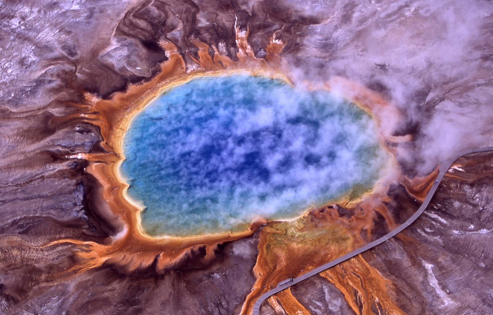<br><sub><b>The photograph.</b> Grand Prismatic Spring, Yellowstone: continuous tone, thousands of colours.</sub></td>
<td width="50%" valign="top"><br><sub><b>Printed.</b> Three inks (Black, Blue, Orange), each screened at its own angle onto natural stock.</sub></td>
</tr>
</table>

Overprint does what a print shop does, not what a filter does: it picks a few spot
inks, works out how much of each belongs at every point in the picture, screens each
ink at its own angle, and prints them one over another onto paper. That is where the
riso look comes from: rosettes where screens cross, ink slightly out of register,
colours the inks can't quite reach, paper grain in the highlights.

It is one static page with no build step and no server. Nothing is uploaded or
recorded, and your photo and settings stay in your browser.

> Every picture on this page can be reproduced: drop
> [`docs/images/source.jpg`](docs/images/source.jpg) on the sheet and pick the matching preset.

## Six treatments of one photograph

<table>
<tr>
<td width="33%" valign="top">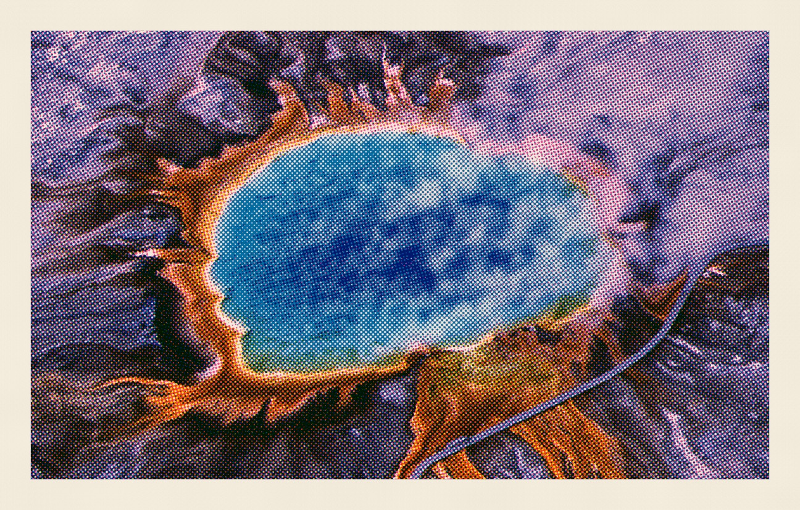<br><b>What Auto-pick chose</b><br><sub>Left to itself the app picked Blue + Fluorescent Pink + Yellow, a process-like triad. Note the lavender cast on the mineral flats: three inks can't reach every colour, and it spends the error on hue rather than tone.</sub></td>
<td width="33%" valign="top">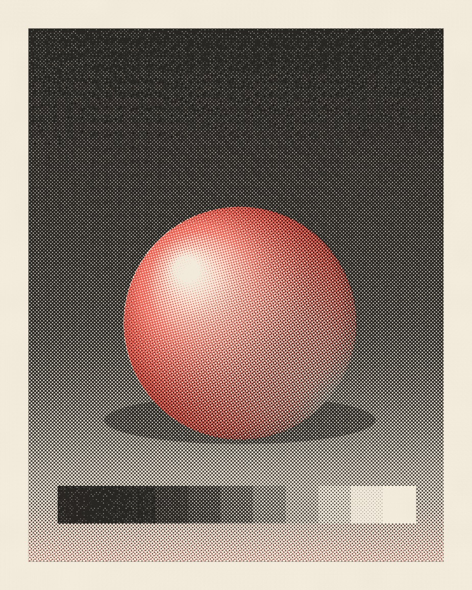<br><b>Two-colour poster</b><br><sub>Blue + Scarlet on natural stock, 34 lpi round dot. Two inks, and the pool still separates cleanly from the mats.</sub></td>
<td width="33%" valign="top">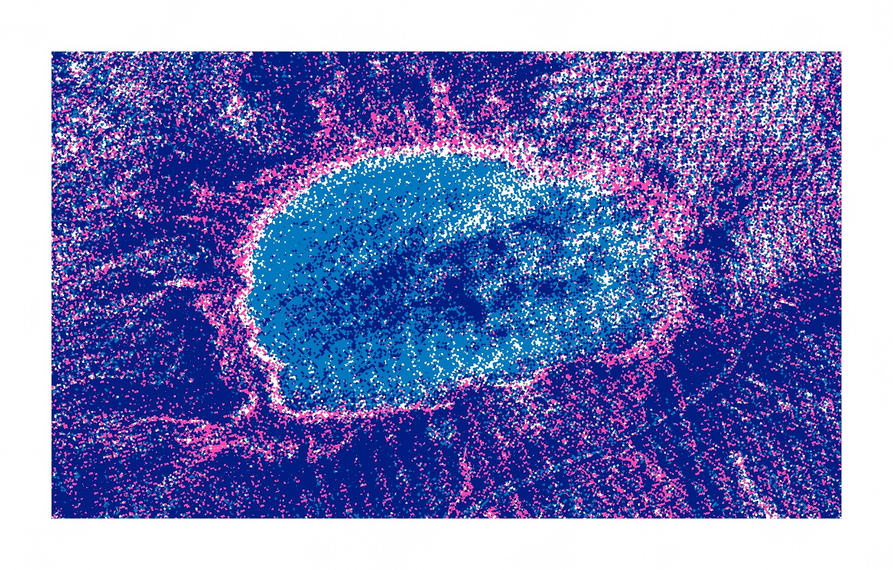<br><b>Fluoro zine</b><br><sub>Fluorescent pink + blue through a grain screen instead of dots, registration deliberately loose.</sub></td>
</tr>
<tr>
<td width="33%" valign="top">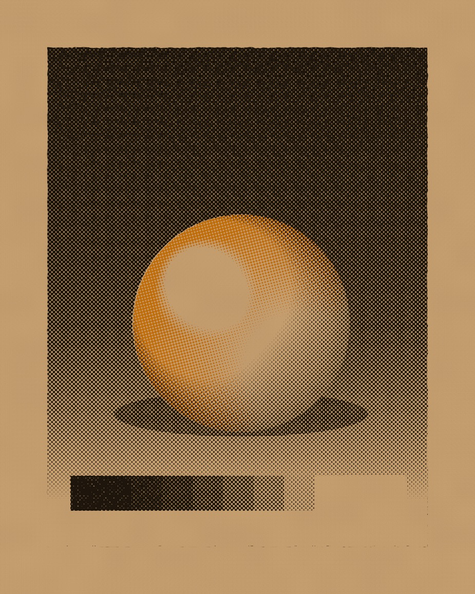<br><b>Kraft duotone</b><br><sub>Black + Sunflower on kraft, diamond screen, hand-cut edge. Dark paper means highlights can only ever be paper.</sub></td>
<td width="33%" valign="top">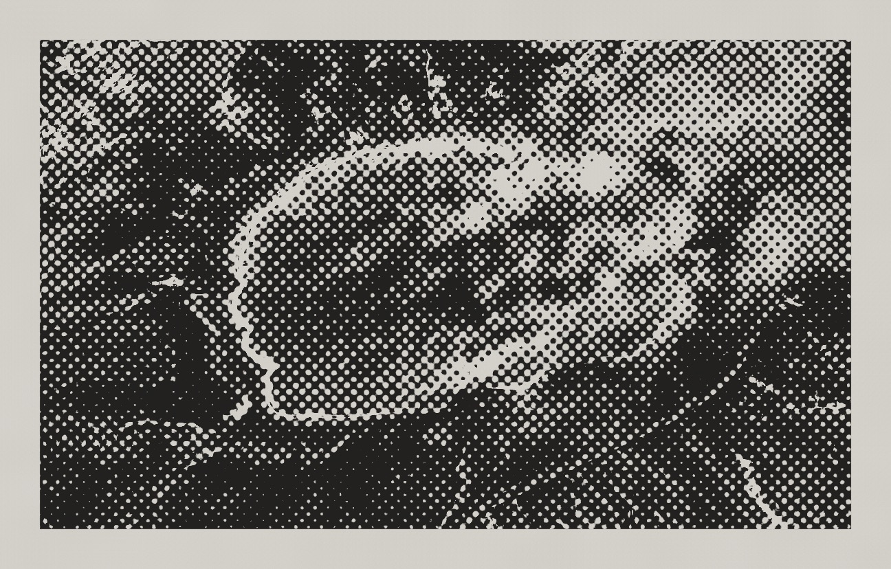<br><b>Coarse dot</b><br><sub>A single ink at 14 lpi. Big enough that you read the dots before the picture.</sub></td>
<td width="33%" valign="top">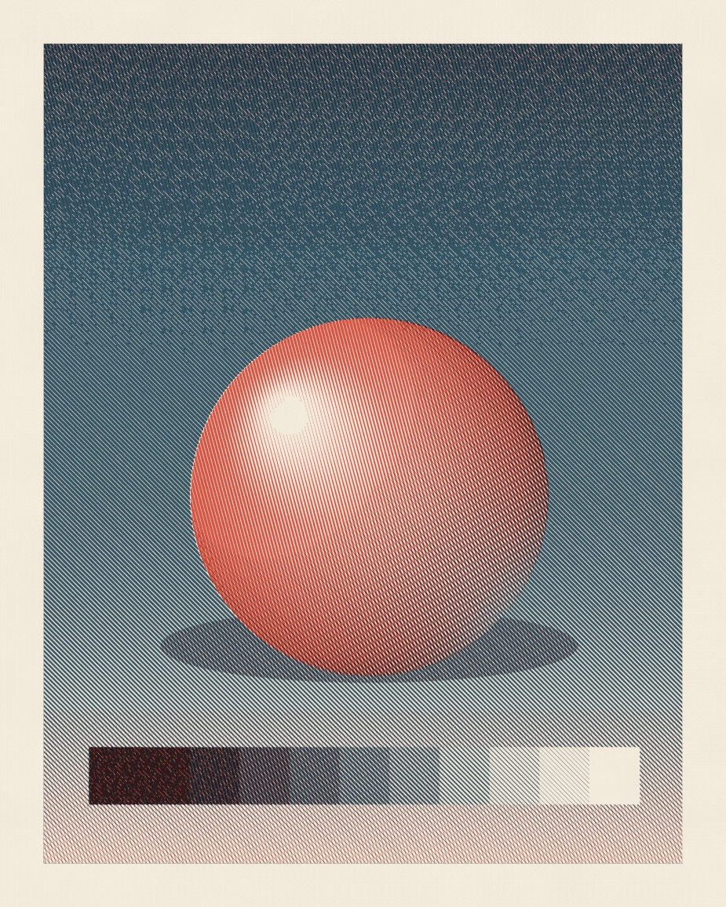<br><b>Line screen</b><br><sub>Steel + Crimson through a 40 lpi line screen, each ink at its own angle.</sub></td>
</tr>
</table>

## Four more, from the one-bit school

The same photograph again, this time through the screens and tricks of
[BitCam](https://bitcam-app.com/), the 1-bit Macintosh camera. A press can do all of
them: an error-diffusion dither is a screen like any other, and a gradient behind or
inside the picture is a flood coat or a split fountain.

<table>
<tr>
<td width="50%" valign="top">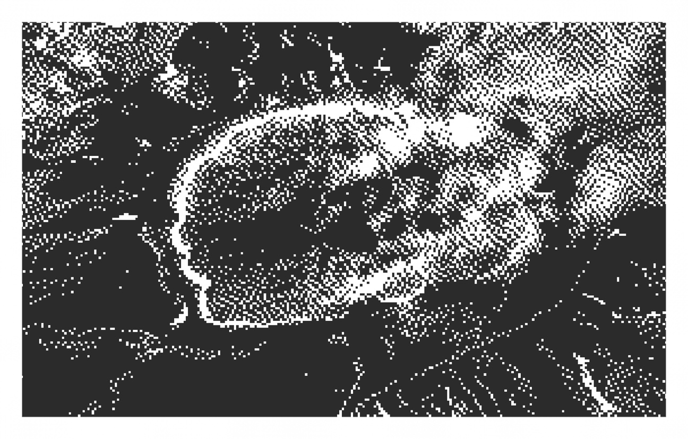<br><b>One-bit</b><br><sub>Black on bright white through an Atkinson dither at 3.5 px. No grey anywhere: every art pixel is ink or paper, and the pool reads because Atkinson spends its error on edges.</sub></td>
<td width="50%" valign="top">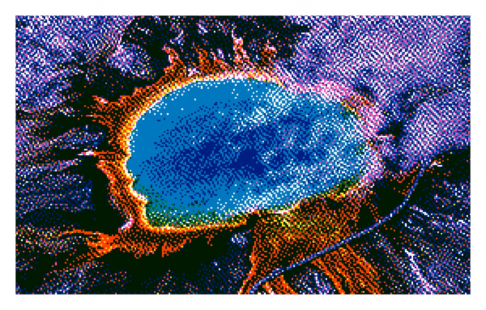<br><b>Eight colours</b><br><sub>Blue + Fluo Pink + Yellow, each a 1-bit dither, overprinted in register. Paper, three inks, three overlaps and all three together: QuickDraw's eight classic colours, which is what BitCam's colour mode is.</sub></td>
</tr>
<tr>
<td width="50%" valign="top">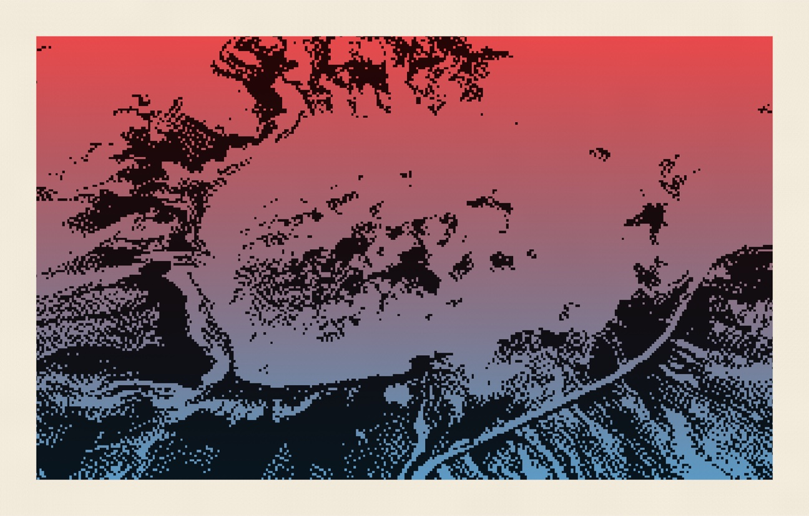<br><b>Woodblock</b><br><sub>A flood coat graded from Scarlet to Cornflower, then black Atkinson on top. The separation is made against the flood, so it uses far less black than the one-bit print above.</sub></td>
<td width="50%" valign="top">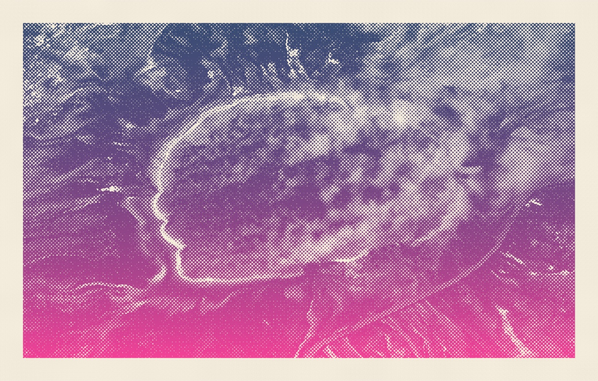<br><b>Split fountain</b><br><sub>One stencil, cut for Federal Blue, printed with Fluo Pink in the far end of the tray. The middle goes through purple because the blend is done in ink density, not on screen.</sub></td>
</tr>
</table>

## How a print is made

The app shows you its own working. The buttons along the top step through the same
stages a press goes through.

**1. The photo.** Whatever you dropped in, with exposure, contrast and saturation applied.

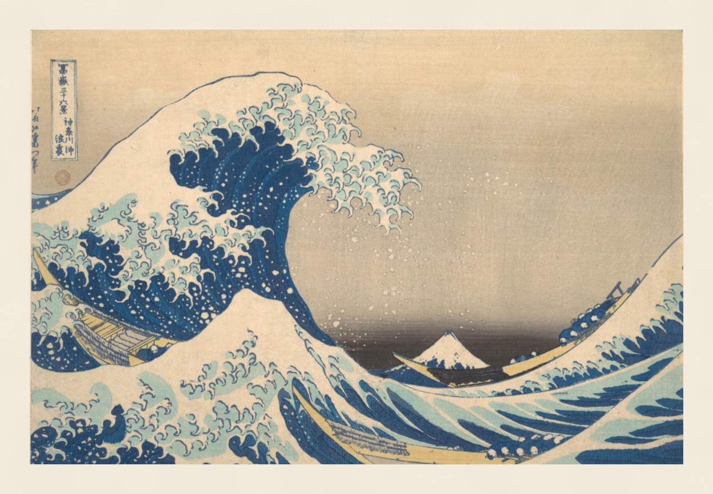

**2. Separation.** The photo resolved into one film per ink: how much black, how much
blue, how much orange belongs at each point. Continuous tone, no dots yet. Look at what
each film ended up carrying: black took the dark mineral structure and the boardwalk,
blue took the pool, orange took the bacterial mats with the pool knocked out of it.

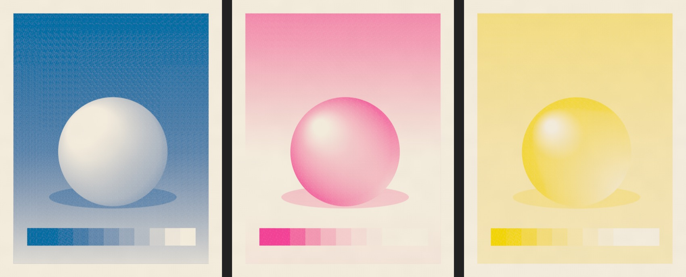

**3. Screening.** Each film broken into dots. Every ink gets its own frequency, angle and
dot shape, which is what stops the three screens landing on top of each other and turning
into a muddy moiré.

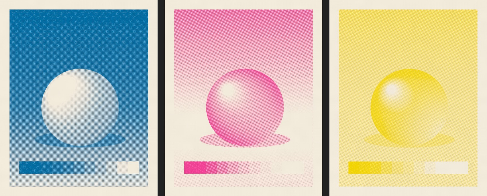

**4. Overprint.** The screened films printed onto the paper in order, each shifted a
fraction against the last. Where dots overlap you get colours that aren't in any single
ink; the green rim around the pool is blue and orange landing together.

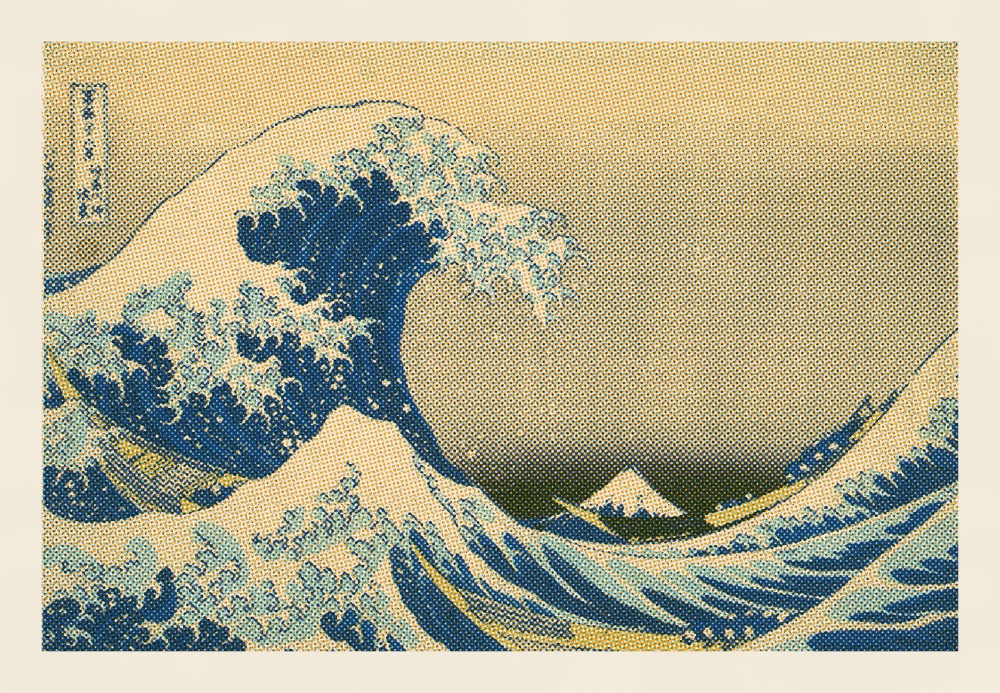

## Screens

Eight ways of breaking a tone into marks, shown on the pool's edge in a single black
ink. The first four are *amplitude* screens at 22 lpi: a regular grid where the marks
grow and shrink. The other four are *frequency* screens: same-sized art pixels,
scattered more densely in the shadows.

<table>
<tr>
<td align="center">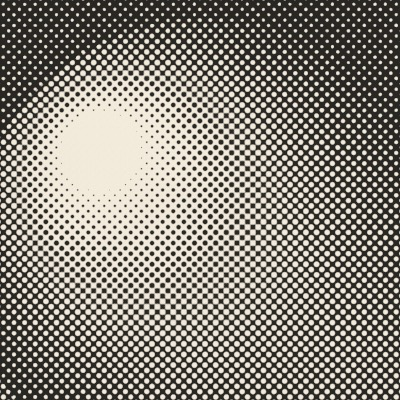<br><b>Dot</b></td>
<td align="center">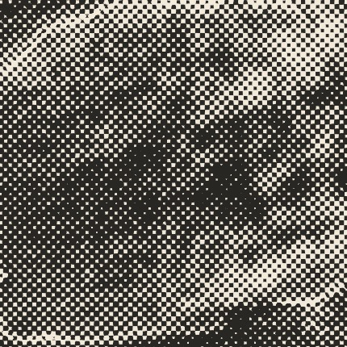<br><b>Diamond</b></td>
<td align="center">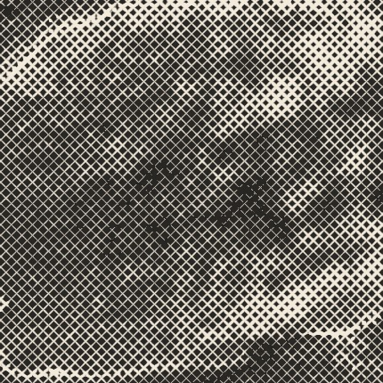<br><b>Square</b></td>
<td align="center"><br><b>Line</b></td>
</tr>
<tr>
<td align="center">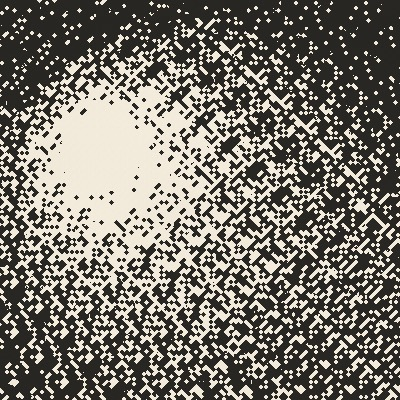<br><b>Grain</b></td>
<td align="center">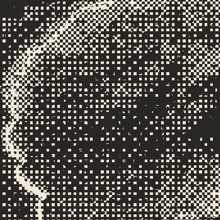<br><b>Bayer</b></td>
<td align="center">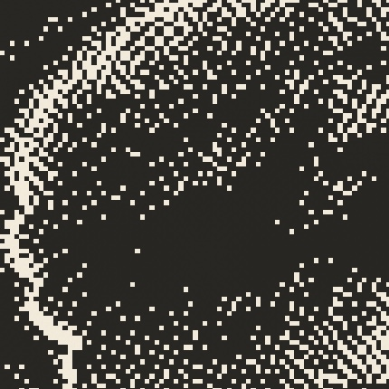<br><b>Atkinson</b></td>
<td align="center"><br><b>Floyd–Steinberg</b></td>
</tr>
</table>

Grain thresholds each pixel against white noise. Bayer thresholds it against a fixed 8×8
matrix, which is why it makes those crosshatch textures. Atkinson and Floyd–Steinberg
are *error diffusion*: each pixel is rounded to ink or paper and the rounding error is
pushed onto the pixels not yet visited, so tone is kept over a neighbourhood rather than
inside a cell. Floyd–Steinberg passes all of the error on and reproduces tone exactly.
Atkinson, Bill Atkinson's kernel from the original Macintosh, deliberately drops a
quarter of it, so highlights clip to clean paper and shadows to solid ink instead of
filling with stray specks. That contrast is the whole 1-bit look, and it is why the
one-bit preset lifts the exposure.

Frequency screens have no angle or frequency; they have a **pixel size**, in px at
150 ppi. The three quick sizes are BitCam's: Fat bits (6 px, 175 pixels across a
7-inch print), Standard (3.5 px, 300 across) and Fine (2 px, 525 across).

## Floods and fountains

Two things a press can do with a gradient that a filter can't.

A **flood coat** is a layer of ink laid over the whole block before the picture: solid,
or graded between two inks in a straight line or out from the centre. It behaves like
coloured paper, and the separator treats it that way: the films are made against the
flooded stock, so a black ink over a red flood carries only the darkness the red can't.
Save separations gives you the flood as its own film, printed first.

A **split fountain** is two inks in one tray, so a single pass prints one colour at one
end of the sheet and another at the other. The stencil is still cut for the first ink;
the second is just what comes out at the far end. The blend between them is interpolated
in ink density rather than in light, which is what keeps a blue-to-yellow fountain green
in the middle rather than grey.

Both take a pair from the same eight quick pairs, or any two inks from the library.

## The interface

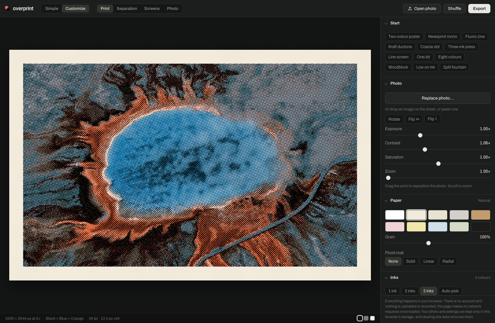

The panel is deliberately colourless. The only saturated thing in the interface is each
channel's actual ink, so nothing competes with the print you're judging.

| Control | What it does |
|---|---|
| **Open photo** (<kbd>O</kbd>) | Loads a new photo. You can also drop an image file on the sheet, or paste one from the clipboard. |
| **Rotate, Flip** | Quarter turns and mirror flips of the photo. Rotating swaps the sheet's orientation with it. |
| **Paper** | Ten stocks: white, natural, newsprint, grey, kraft, four pastels and black. Dark stock means highlights can only ever be paper. |
| **Ink picker** | The 78 Riso drum colours in hue order, White included, plus a rainbow swatch that takes any colour from the system picker. |
| **Hiding** | Per ink, in Customize. How much a solid dot covers the paper rather than filtering it; each ink comes with its own value. |
| **Auto-pick** | Searches the 26 common drum colours for the set that reproduces *this* photo on *this* paper most closely. It measures reproduction error, so it picks a process-like triad for one image and two flat colours for another. |
| **Screen angle dial** | Drag it. Hold <kbd>Shift</kbd> to snap to 7.5°, or use the arrow keys. |
| **Pixel size** | For the frequency screens. The Fat bits, Standard and Fine chips are BitCam's three resolutions. |
| **Flood coat** | Under Paper. None, solid, or a linear or radial gradient between two inks, laid down before the picture. |
| **Split fountain** | Per ink, in Customize. Blends the channel's ink into a second one across the sheet. |
| **Shuffle** (<kbd>R</kbd>) | Keeps your photo, reprints it with new inks, screen and frame. Now and then it floods the sheet or splits a fountain. |
| **Misregistration** | Shifts every ink but the first, the way a second pass through the drum would. |
| **Ink fade** | The drum running low: density falls away toward the trailing edge, unevenly. |
| **Roller streaks** | Bands of heavier and lighter ink across the feed, at the drum's rhythm. |
| **Highlight knockout** | Prints no ink below a chosen coverage, so the lightest tones stay clean paper. Worth having on with dithers. |
| **Marks** | Crop marks at the corners, and optionally registration targets on each side. They go down with every ink, so with misregistration on you can see the targets split, as on a real proof. Separations carry them too. |
| **Hand-cut edge** | Roughens the edge of the ink block, like paper torn against a ruler. |
| **Surround** | Dark, neutral grey or white behind the sheet. The grey is the ISO 3664 viewing grey you'd judge a real proof against. |
| **Save separations** | One PNG per ink, ready to take to an actual press, plus one for the flood if there is one. |

Your photo and settings are kept in your browser and restored when you come back.

## Run it locally

```sh
git clone https://github.com/chuwd19/overprint.git
cd overprint
./run.sh          # serves on :8123 and opens a browser
```

ES modules need a real origin, so opening `index.html` straight from the Finder won't
work; hence the tiny server. Any browser with WebGL2 will do (Safari 15+, Chrome,
Firefox, and mobile Safari).

To host your own copy, push it anywhere that serves static files. There's no build step;
the app itself is 109 KB, plus 66 KB of typeface.

## Under the hood

The part worth reading about is the separation, because it's where a print simulator
usually goes wrong.

**Ink doesn't work like a filter.** The obvious model is Beer–Lambert: light passes
through ink and gets attenuated, so density adds up. That's true of a solid film, but a
*screened tint* isn't a film. It's a scattering of solid dots with bare paper between
them, and what you see is the average. So reflectance is **linear** in coverage, not
exponential. And a dot isn't a pure filter either: ink has *hiding power*, so a solid
dot is the base seen through the ink, pulled toward the ink's own colour. With inks laid
down in printing order on paper $R_0 = P$,

$$
\mathrm{dot}_i = (1 - h_i)\, R_{i-1} \odot C_i + h_i\, C_i,
\qquad
R_i = R_{i-1} + a_i \left( \mathrm{dot}_i - R_{i-1} \right)
$$

for ink colour $C_i$ with hiding $h_i$ and coverage $a_i$, the fraction of the area the
ink occupies. With $h = 0$ this collapses to the Murray–Davies relation,

$$
R = P \prod_i \bigl( 1 - a_i (1 - C_i) \bigr).
$$

Riso inks are glazes, so most sit near that; light inks carry white pigment and hide
more, and White is mostly cover, which is the only reason it does anything on black stock.

Getting from a photo to those coverages means inverting the model, a small nonlinear
least-squares problem solved per pixel: a least-squares seed from the model linearised
around the paper, then four Gauss–Newton steps on the relative residual
$(R_\text{target} - R) / R$, which is the density error to first order. The fit is
weighted toward luminance, so a colour outside the ink set's reach loses its hue before
it loses its tone.

It's worth doing properly. The first version used plain Beer–Lambert and mid-grey came
out as `#c3adb6`, visibly washed out, with every photo needing the density cranked by
hand. With the correct model, a single black ink reproduces a grey ramp **exactly**.

**Screening keeps tone honest.** A dot's radius is derived from the coverage $d$ it needs
to represent, $r = \sqrt{d / \pi}$ for a round dot, rather than being scaled by eye, so
tones don't drift as the frequency changes. Past 50% coverage neighbouring dots would merge and the
maths stops working, so the shader crosses over to drawing shrinking *holes* at the cell
corners instead.

**Error diffusion can't run in a fragment shader.** Every other screen decides each
pixel on its own, so the whole print is one pass of one shader. Atkinson and
Floyd–Steinberg need to know what their neighbours decided, so the renderer takes a
detour: it runs the same shader with one fragment per art pixel and asks only for that
ink's coverage, reads the result back, diffuses it on the CPU (`src/dither.js`, which has
no browser dependencies), and hands the 1-bit map back to the print pass as a texture.
The art-pixel grid is sized in physical units like everything else, so the preview and a
3× export have the same number of art pixels and the same dither pattern.

**Everything is in physical units.** Frequency is lines per inch against a 7-inch long
edge, so a 3× export has the same physical dot size as what you saw on screen, just with
more pixels describing it.

**Auto-pick is a search, not a heuristic.** It scores every candidate ink set by how
closely it reproduces a sample of your photo's pixels, in Oklab. Every pair and every
triple is screened on a few of the samples, the survivors re-scored on all of them, and
the best triple is refined slot by slot until no swap helps; on the 26-ink pool that
lands on the same answer as an exhaustive search. It runs in a worker so the page stays
live. The pool is the common drum colours rather than the full library: the tints and
greys add little, and White in particular would be chosen on pale stock to brighten
highlights beyond the paper, which the model allows and no print does. Shuffle draws
from the same pool, and waits for the fit before it changes the print.

## Project layout

```
index.html        page shell
src/style.css     interface
src/fonts/        Archivo, self-hosted (SIL OFL)
src/color.js      sRGB ↔ linear, Oklab, small matrix inverse
src/inks.js       ink library, paper stocks, presets
src/separate.js   the separator and Auto-pick; runs standalone in node, too
src/autopick-worker.js  Auto-pick off the main thread
src/dither.js     error-diffusion screens; also standalone
src/render.js     WebGL2 renderer and the shader
src/app.js        state, controls, export, session storage
docs/images/      everything on this page, including the source scan
```

`src/separate.js` has no browser dependencies, so you can import it in node and check the
colour maths for yourself.

## Not implemented

Bleed and true-size imposition. Saving your own presets, deliberately: the site keeps no
account and records nothing. Metallic inks print as flat colour; there is no sheen.

## Licence

MIT; see [LICENSE](LICENSE). The demo photograph is public domain (see Credits).

## Credits

Inspired by [tone](https://apps.apple.com/us/app/tone-photos-printed/id6792391699) and
[BitCam](https://bitcam-app.com/). tone does the same job on iOS and is worth your money
if you're on a phone. BitCam, the Iconfactory's (now Héliographe's) Macintosh camera, is
where the dithers, the pixel sizes and the idea of a gradient behind or inside a 1-bit
picture come from. It does one thing and does it perfectly.

The ink colours are the Riso drum list kept by [stencil.wiki](https://stencil.wiki/), as
collected in [riso-colors](https://github.com/mattdesl/riso-colors) by Matt DesLauriers.

The interface is set in [Archivo](https://github.com/Omnibus-Type/Archivo) by Omnibus-Type,
under the SIL Open Font License, and served with the page rather than from a font CDN.

The demo photograph is Grand Prismatic Spring, Yellowstone National Park, by Jim Peaco
for the [National Park Service](https://commons.wikimedia.org/wiki/File:Grand_prismatic_spring.jpg).
As a work of the US government it is in the public domain. It was picked because it is an
ordinary photograph that happens to run the whole way from deep blue through cyan, green
and yellow to rust, which is exactly the kind of thing a three-ink press has to fight.
