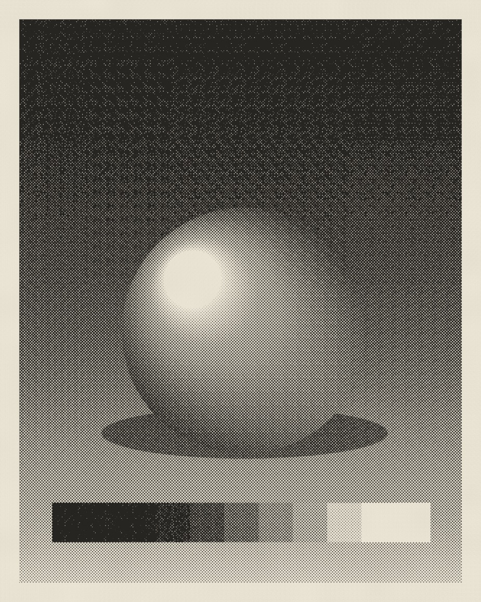

<div align="center">

# Overprint

**Turn a photo into a risograph print, in the browser.**

[**Try it live →**](https://chuwd19.github.io/overprint/)


</div>

---

Overprint doesn't lay a dot filter over your photo. It does roughly what a print shop
does: pick a handful of spot inks, work out how much of each one belongs at every point
in the picture, screen each ink into its own grid of dots at its own angle, then print
them one on top of another onto paper.

You get the things that make a riso print look like a riso print — rosettes where the
screens cross, ink that drifts slightly out of register, colours the ink set can't
quite reach, and paper grain showing through the highlights.

It's a single static page. No build step, no dependencies, no server, nothing uploaded —
your photo is decoded and drawn entirely in your own browser.

## Six treatments of one photo

Every picture on this page came from the test image built into the app, so you can
reproduce all of them without supplying a photo of your own. Click **Use a test image**,
then pick a preset.

<table>
<tr>
<td width="33%" valign="top"><br><b>Two-colour poster</b><br><sub>Black + Red on natural stock, 34 lpi round dot. The everyday riso look.</sub></td>
<td width="33%" valign="top"><br><b>Newsprint mono</b><br><sub>One black ink at 42 lpi on newsprint, with the tone curve pushed for contrast.</sub></td>
<td width="33%" valign="top"><br><b>Fluoro zine</b><br><sub>Fluorescent pink + blue, grain screen instead of dots, registration deliberately loose.</sub></td>
</tr>
<tr>
<td width="33%" valign="top"><br><b>Kraft duotone</b><br><sub>Black + Sunflower on kraft. Dark paper means highlights can only ever be paper.</sub></td>
<td width="33%" valign="top"><br><b>Coarse dot</b><br><sub>A single ink at 14 lpi. Big enough that you read the dots before the picture.</sub></td>
<td width="33%" valign="top"><br><b>Line screen</b><br><sub>Steel + Crimson through a 40 lpi line screen, each ink at its own angle.</sub></td>
</tr>
</table>

## How a print is made

The app will show you its own working. The four buttons at the top of the window step
through the same stages a press goes through.

**1. The photo.** Whatever you dropped in, with exposure, contrast and saturation applied.


**2. Separation.** The photo is resolved into one film per ink — how much blue, how much
pink, how much yellow belongs at each point. These are continuous tones, no dots yet.
Notice that the blue film carries the backdrop while pink and yellow carry the sphere.


**3. Screening.** Each film is broken into dots. Every ink gets its own frequency, angle
and dot shape — that's what stops the three screens from landing on top of each other and
turning into a muddy moiré.


**4. Overprint.** The screened films are printed onto the paper in order, each shifted a
fraction against the last. Where dots overlap you get colours that aren't in any single
ink — the teal backdrop here is blue and yellow landing together.


## Screens

Five ways of breaking a tone into marks, shown at 22 lpi on a single black ink.
The first four are *amplitude* screens — a regular grid where the marks grow. The last
one is *frequency* — same-sized specks, scattered more densely in the shadows.

<table>
<tr>
<td align="center"><br><b>Dot</b></td>
<td align="center"><br><b>Diamond</b></td>
<td align="center"><br><b>Square</b></td>
<td align="center"><br><b>Line</b></td>
<td align="center"><br><b>Grain</b></td>
</tr>
</table>

## The interface


The panel is deliberately colourless — the only saturated thing in the interface is each
channel's actual ink, so nothing competes with the print you're judging.

A few controls worth knowing about:

| Control | What it does |
|---|---|
| **Auto-pick** | Searches the ink library for the set that reproduces *this* photo on *this* paper most closely. It measures reproduction error, so it will pick a process-like triad for one photo and two flat colours for another. |
| **Screen angle dial** | Drag it. Hold <kbd>Shift</kbd> to snap to 7.5°, or use the arrow keys. |
| **Shuffle** (<kbd>R</kbd>) | Keeps your photo, reprints it with new inks, screen and frame. |
| **Misregistration** | Shifts every ink but the first, the way a second pass through the drum would. |
| **Hand-cut edge** | Roughens the edge of the ink block, like paper torn against a ruler. |
| **Surround** | Dark, neutral grey or white behind the sheet. The grey is the ISO 3664 viewing grey, which is what you'd judge a real proof against. |
| **Save separations** | One PNG per ink, ready to take to an actual press. |

Your photo and settings are kept in your browser and restored when you come back.

## Run it locally

```sh
git clone https://github.com/chuwd19/overprint.git
cd overprint
./run.sh          # serves on :8123 and opens a browser
```

ES modules need a real origin, so opening `index.html` straight from the Finder won't
work — hence the tiny server. Any browser with WebGL2 will do (Safari 15+, Chrome,
Firefox, and mobile Safari).

To host your own copy, push it anywhere that serves static files. There's no build
step; the whole thing is 76 KB.

## Under the hood

The part worth reading about is the separation, because it's where a print simulator
usually goes wrong.

**Ink doesn't work like a filter.** The obvious model is Beer–Lambert — light passes
through ink and gets attenuated, so density adds up. That's true of a solid film, but a
*screened tint* isn't a film. It's a scattering of solid dots with bare paper between
them, and what you see is the average. So reflectance is **linear** in coverage, not
exponential:

```
R = P · ∏ (1 − aᵢ(1 − Cᵢ))
```

for ink colours `C` on paper `P`, with `a` the fraction of the area each ink covers.
That's the Murray–Davies relation, and it's what the renderer composites.

Getting from a photo to those coverages means inverting it, which is a small nonlinear
least-squares problem — solved per pixel with a linear-absorbance estimate followed by
three Gauss–Newton steps in density space. The fit is weighted toward luminance, so a
colour outside the ink set's reach loses its hue before it loses its tone.

It's worth doing properly. The first version used plain Beer–Lambert and mid-grey came
out as `#c3adb6` — visibly washed out, with every photo needing the density cranked by
hand. With the correct model, a single black ink reproduces a grey ramp **exactly**.

**Screening keeps tone honest.** A dot's radius is derived from the coverage it needs to
represent — `r = √(d/π)` for a round dot — rather than being scaled by eye, so tones
don't drift as the frequency changes. Past 50% coverage neighbouring dots would merge and
the maths stops working, so the shader crosses over to drawing shrinking *holes* at the
cell corners instead.

**Everything is in physical units.** Frequency is lines per inch against a 7-inch long
edge, so a 3× export has the same physical dot size as what you saw on screen, just with
more pixels describing it.

**Auto-pick is a search, not a heuristic.** It scores every candidate ink set by how
closely it reproduces a sample of your photo's pixels, in Oklab. Exhaustive over pairs;
for three inks it seeds from the best pair and refines each slot until no swap helps.

## Project layout

```
index.html        page shell
src/style.css     interface
src/color.js      sRGB ↔ linear, Oklab, small matrix inverse
src/inks.js       ink library, paper stocks, presets
src/separate.js   the separator — runs standalone in node, too
src/render.js     WebGL2 renderer and the shader
src/app.js        state, controls, export, session storage
```

`src/separate.js` has no browser dependencies, so you can import it in node and check
the colour maths for yourself.

## Not implemented

Crop marks, bleed and true-size imposition; saving your own presets. The ink library is
26 Riso-like colours rather than a full swatch book.

## Credits

Built after Apple's [tone](https://apps.apple.com/us/app/tone-photos-printed/id6792391699),
which does the same job on iOS and is worth your money if you're on a phone.
